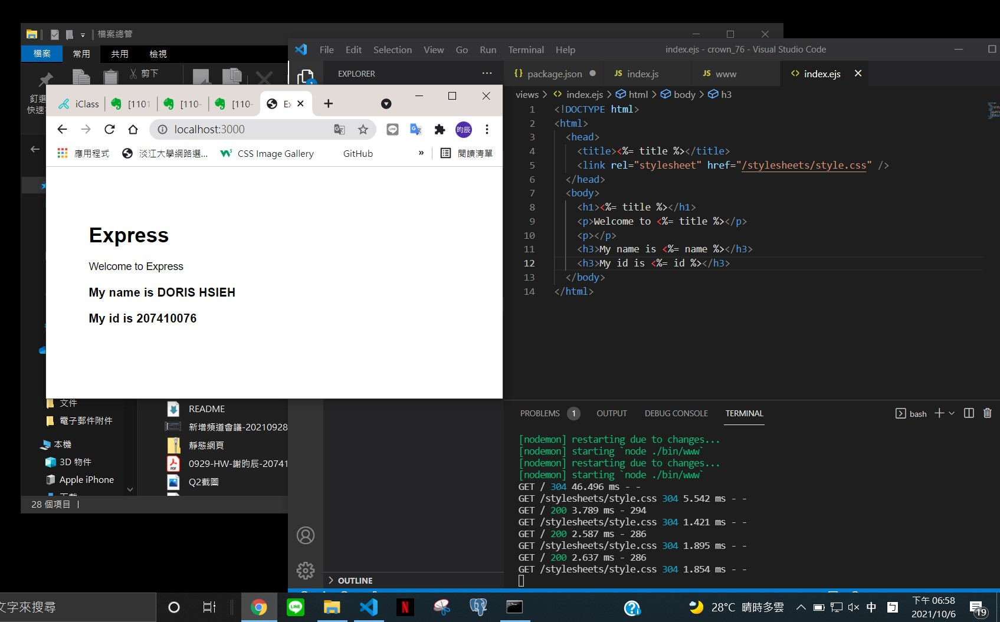
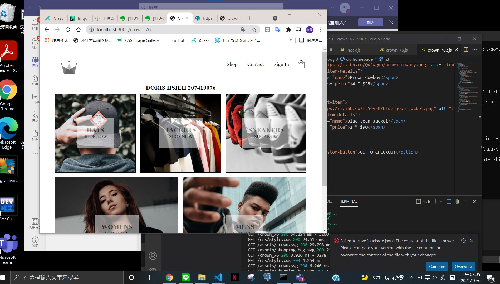

##w3

####第一題

package.jason
```
{
  "name": "crown-76",
  "version": "0.0.0",
  "private": true,
  "scripts": {
    "start": "nodemon ./bin/www"
  },

  "dependencies": {
    "cookie-parser": "~1.4.4",
    "debug": "~2.6.9",
    "ejs": "~2.6.1",
    "express": "~4.16.1",
    "http-errors": "~1.6.3",
    "morgan": "~1.9.1"
  }
}
```
index.js

```
var express = require('express');
var router = express.Router();

/* GET home page. */
router.get('/', function (req, res, next) {
  res.render('index', {
    title: 'Express',
    name: 'DORIS HSIEH',
    id: '207410076',
  });
});
module.exports = router;

```
index.ejs
```
<!DOCTYPE html>
<html>
  <head>
    <title><%= title %></title>
    <link rel="stylesheet" href="/stylesheets/style.css" />
  </head>
  <body>
    <h1><%= title %></h1>
    <p>Welcome to <%= title %></p>
    <p></p>
    <h3>My name is <%= name %></h3>
    <h3>My id is <%= id %></h3>
  </body>
</html>
```



####第二題
